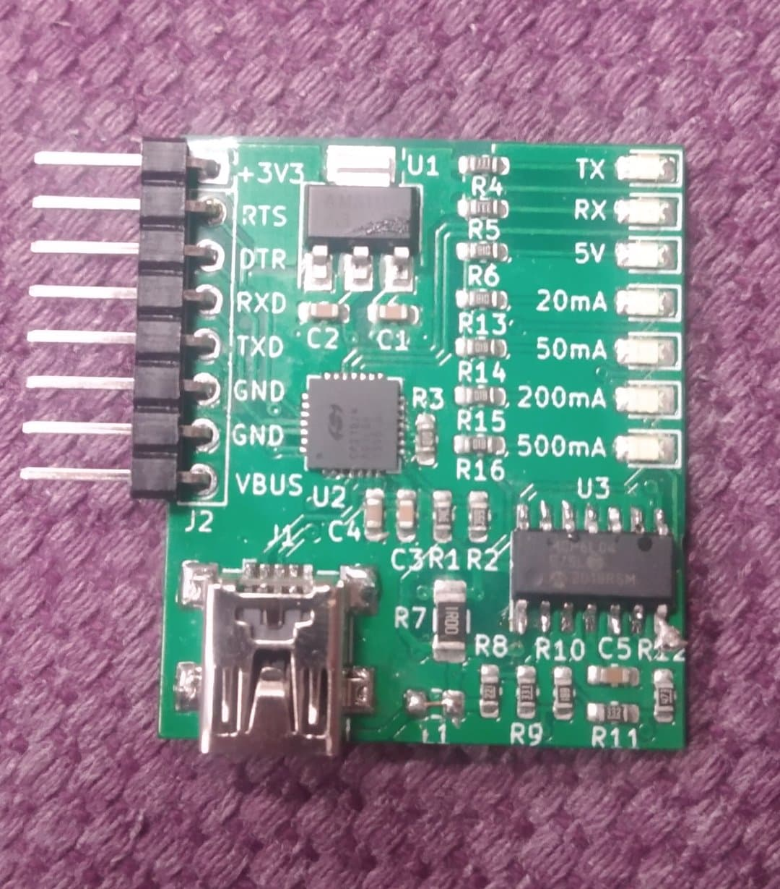

## Lichtenprog - an rather-cheap-USB-to-UART-bridge-with-3v3-out

### Raison d'etre

The device is based on CP2102n - meaning it should work properly on any OS without messy drivers from unknown sources. It's also cheaper than legit FT232 chips.

Why can't I power my stuff from basic USB-to-UART bridges? Some of those serial adapters out there have basic 3.3V-out bulitin, coming usually from main IC's LDO output. Being able to supply like 100 miliamps. I want my full 500mA from the USB! Seriously, throwing that external LDO costs like 10 cents.

I also added an simple circut for estimating the connected device's current draw. You may left it unpopulated, to save like another 70c.

Honestly, I've found myself using this board to supply my 3v3 devices from wallplugs, it's just convenient to have like 10 of those.

## Customizing your Lichtenprog

After soldering your device, you may want to reprogram the CP2102n a little bit, in order to set:
 * TX/RX leds functionality (by default disabled)
 * Max current draw USB descriptor
 * Your custom name and manufacturer name (yay!)

Please, just do not modify PID and VID, or els you risk effectively bricking your brand new 3$ device.

To modify these values, you may use official "xpressconfigurator" from SiLabs

I couldn't make this tool to work on linux though - take a look at this CLI-based project, which should allow setting up basic stuff.

https://github.com/cr1tbit/cp210x-cfg

## Photo

## License
MIT. Have fun.
